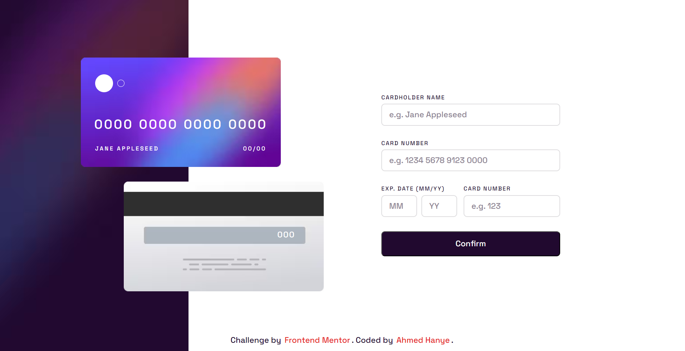

# Interactive Card Details Form

Demo Link: https://ahmedhanye.github.io/interactive-card-details-form-main/

## Features

- Realistic front and back card views.
- Responsive design for optimal viewing on various devices.
- Input validation for cardholder name, card number, expiration date, and CVC.
- Visually appealing animations and transitions.
- Confirmation button to submit the form.
## Technologies Used
- HTML
- CSS
- JS
- Font: Space Grotesk
- ...
